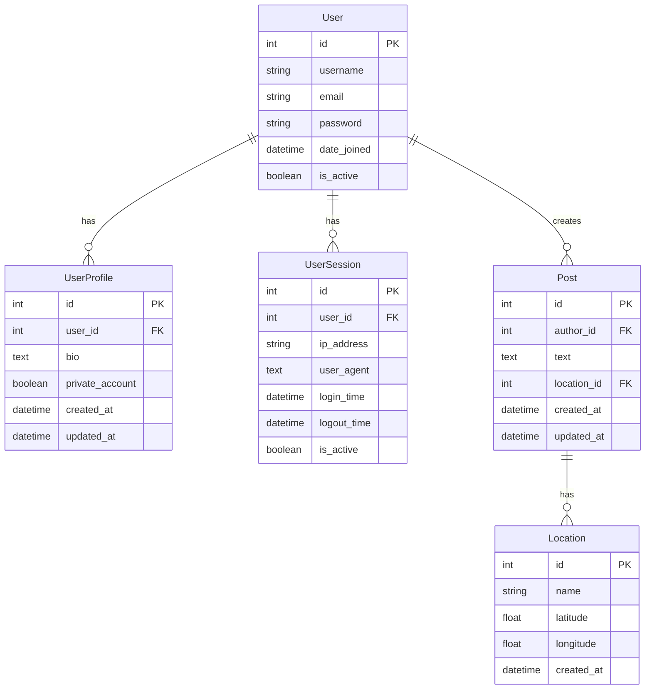
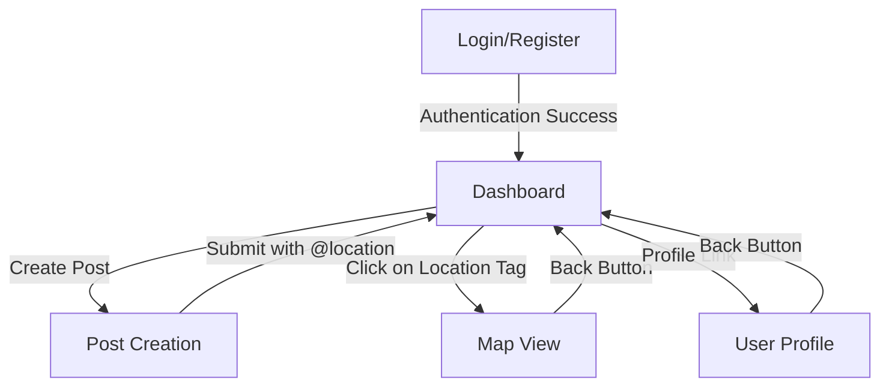
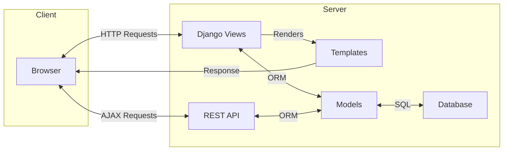

# LocaFeed

LocaFeed is a location-based social media application built with Django that allows users to share posts with location data. Users can tag specific locations in their posts and explore content on an interactive map.

## Features

- User authentication (register, login, logout)
- Create posts with location tagging using @ mentions
- Interactive map to explore posts by location
- User profiles with post history
- Location search functionality
- Responsive design with Bootstrap

## Entity Relationship Diagram



## Application Flow



## System Architecture

LocaFeed follows a standard Django MVT (Model-View-Template) architecture:



## Installation & Setup

### Prerequisites

- Python 3.8+
- Poetry (dependency management)
- Git

### Installation Steps

1. Clone the repository:
   ```bash
   git clone https://github.com/yourusername/locafeed.git
   cd locafeed
   ```

2. Install dependencies with Poetry:
   ```bash
   # Install Poetry if you don't have it
   # curl -sSL https://install.python-poetry.org | python3 -
   
   # Install dependencies
   poetry install
   ```

3. Activate the Poetry environment:
   ```bash
   poetry shell
   ```

4. Apply migrations:
   ```bash
   python manage.py migrate
   ```

5. Create a superuser (admin):
   ```bash
   python manage.py createsuperuser
   ```

6. Run the development server:
   ```bash
   python manage.py runserver
   ```

7. Access the application at `http://localhost:8000`

## Deployment

### Deploy to PythonAnywhere

1. Create a PythonAnywhere account at [https://www.pythonanywhere.com](https://www.pythonanywhere.com)

2. Log in and open a Bash console

3. Clone the repository:

   ```bash
   git clone https://github.com/yourusername/locafeed.git
   cd locafeed
   ```

4. Set up Poetry on PythonAnywhere:

   ```bash
   curl -sSL https://install.python-poetry.org | python3 -
   ```

5. Add Poetry to your PATH (add this to your .bashrc file):

   ```bash
   export PATH="$HOME/.local/bin:$PATH"
   ```

6. Install dependencies using Poetry:

   ```bash
   poetry config virtualenvs.in-project true
   poetry install
   ```

7. Configure a new web app in the PythonAnywhere dashboard:
   - Go to the Web tab and create a new web app
   - Select "Manual Configuration"
   - Select Python version (3.8 or higher)

8. Configure the WSGI file (click on the WSGI file link in the web app configuration):

   ```python
   import os
   import sys
   
   # Add your project directory to the sys.path
   project_path = '/home/yourusername/locafeed'
   if project_path not in sys.path:
       sys.path.insert(0, project_path)
   
   # Find the poetry-generated virtual environment
   # The .venv is inside the project directory when using poetry config virtualenvs.in-project true
   venv_path = os.path.join(project_path, '.venv')
   
   # Detect Python version dynamically
   python_version = None
   for dir_name in os.listdir(os.path.join(venv_path, 'lib')):
       if dir_name.startswith('python'):
           python_version = dir_name
           break
   
   if not python_version:
       raise ImportError("Could not detect Python version in the virtual environment")
   
   # Add site-packages to path
   site_packages = os.path.join(venv_path, 'lib', python_version, 'site-packages')
   if site_packages not in sys.path:
       sys.path.insert(0, site_packages)
   
   # Set environment variables
   os.environ['DJANGO_SETTINGS_MODULE'] = 'locafeed.settings'
   os.environ['DJANGO_DEBUG'] = 'False'
   
   # Import Django
   from django.core.wsgi import get_wsgi_application
   application = get_wsgi_application()
   ```

9. Configure static files in the Web tab:
   - Set URL to `/static/` and Path to `/home/yourusername/locafeed/static`

10. Apply migrations and create a superuser:

    ```bash
    cd ~/locafeed
    poetry run python manage.py migrate
    poetry run python manage.py collectstatic
    poetry run python manage.py createsuperuser
    ```

11. Reload your web app from the PythonAnywhere dashboard

12. Your site should now be live at `yourusername.pythonanywhere.com`

## Technology Stack

- **Backend**: Django, Django REST Framework
- **Database**: SQLite (development), PostgreSQL (recommended for production)
- **Frontend**: HTML, CSS, JavaScript, Bootstrap 5
- **Map**: Leaflet.js with OpenStreetMap
- **Authentication**: Django Knox for token-based authentication

## Important Notes

This project meant to be a simple social media application that allows users to share posts with location data. This project is a task to satisfied code-test by LDCI and not intended to be a production-ready application.